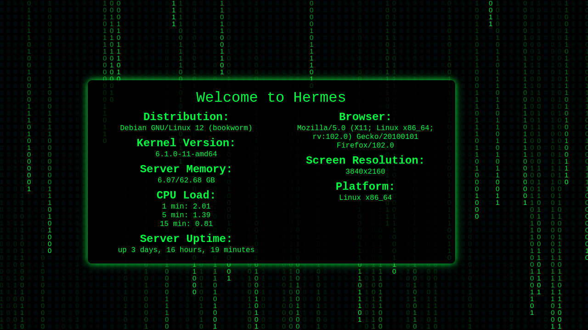

# Localhost Landing Page



A simple localhost landing page with server information and a binary matrix animation. This repository provides a basic structure for a landing page that displays server details and includes an engaging visual element.

## Table of Contents

- [Localhost Landing Page](#localhost-landing-page)
  - [Table of Contents](#table-of-contents)
  - [Features](#features)
  - [Getting Started](#getting-started)
    - [Prerequisites](#prerequisites)
    - [Installation](#installation)
    - [Usage](#usage)
    - [Contributing](#contributing)
    - [License](#license)

## Features

- Display server information, including memory usage, CPU load, uptime, hostname, kernel version, and distribution.
- Visualize a binary matrix animation on the page.
- Responsive design with user-agent, screen resolution, and platform information.

## Getting Started

### Prerequisites

- A web server or a development environment to run this project locally.
- PHP installed to run the `server-info.php` script.

### Installation

1. Clone the repository to your local machine:

   ```bash
   git clone git@github.com:zkm/localhost.git

2. Navigate to the project directory: 

   ```bash
   cd localhost-landing-page

3. Start your web server or development environment.

### Usage

1. Access the landing page via your web server or localhost URL (e.g., http://localhost/).
2. The server information will be fetched and displayed dynamically.
3. Enjoy the mesmerizing binary matrix animation.

### Contributing

Contributions are welcome! If you'd like to enhance this project or fix any issues, please follow these steps:

1. Fork the repository.
2. Create a new branch for your feature or bug fix: git checkout -b feature/your-feature-name or bugfix/issue-description.
3. Commit your changes: git commit -m "Add your feature".
4. Push to your branch: git push origin feature/your-feature-name.
5. Submit a pull request to the main repository.

### License

This project is licensed under the MIT License - see the [LICENSE](LICENSE) file for details.
